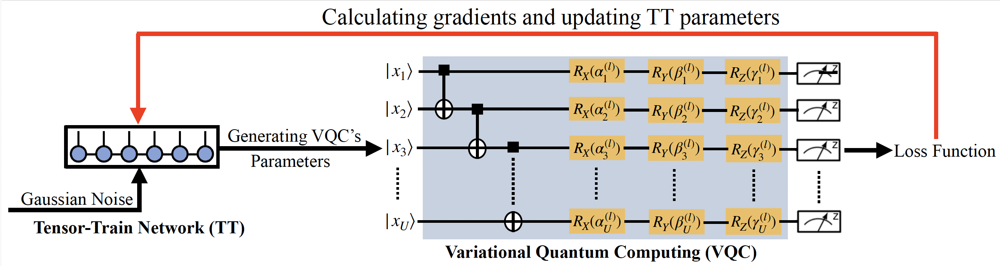

# TensorHyper-VQC 
### A Tensor-Train-Guided Hypernetwork for Robust and Scalable Variational Quantum Computing

📄 **Published in npj Quantum Information (2026)** 
DOI: https://doi.org/10.1038/s41534-025-01157-z  

---

## 🧠 Framework Architecture

<p align="center">
  
</p>

<p align="center">
  <em>Figure 1: TensorHyper-VQC architecture. A classical TT network generates variational parameters injected into a fixed quantum circuit. Gradients are backpropagated only through TT-cores, mitigating barren plateaus and enhancing noise robustness.</em>
</p>

---

## 🚀 Overview 

**TensorHyper-VQC** is a tensor-train (TT) guided hypernetwork framework designed to overcome two fundamental challenges in Variational Quantum Computing (VQC):

- Barren plateaus (vanishing gradients)
- Sensitivity to quantum noise
- Poor scalability with increasing qubits and circuit depth

Instead of directly optimizing quantum gate parameters on hardware, TensorHyper-VQC delegates parameter generation to a classical Tensor-Train (TT) network.

The quantum circuit acts only as a forward-pass evaluator, while all gradient updates occur in the classical domain.

This classical–quantum decoupling results in:

- ✔ Improved trainability (NTK enhancement)
- ✔ $\mathcal{O}\left(\frac{1}{UL}\right)$ gradient variance reduction
- ✔ Stronger generalization control via low-rank structure
- ✔ Hardware-level robustness without explicit mitigation

---

## 🧠 Core Idea 

For a VQC with $U$ qubits and $L$ layers,

A conventional VQC directly optimizes:   $\textbf{w} \in \mathbb{R}^{3UL}$

TensorHyper-VQC instead parameterizes:   $\textbf{w} = \text{TT}(\textbf{z}; \mathcal{G}_1, ..., \mathcal{G}_K)$, where:
- $\textbf{z} \sim \mathcal{N}(0, I)$
- $\mathcal{G}_1, ..., \mathcal{G}_K$ are TT-cores
- Optimization is performed only over TT-cores
- Quantum circuit performs inference only

---

## 📊 Comparison with Standard VQC 

| Feature                | Standard VQC | TensorHyper-VQC                        |
| ---------------------- | ------------ | -------------------------------------- |
| Gradient domain        | Quantum      |     Classical                          |
| Barren plateau         | Severe       |     Mitigated                          |
| Noise scaling          | O(1)         |$\mathcal{O}\left(\frac{1}{UL}\right)$  |
| Parameter efficiency   | Low          |     High                               |
| Hardware robustness    | Limited      |     Strong                             |
| Theoretical guarantees | Limited      | NTK + Generalization + Variance bounds |

---

## 🔬 Applications Demonstrated 

TensorHyper-VQC is validated across three major tasks:

### 1️⃣ Quantum Dot Classification (20 qubits, depth 6)

- 99.5% accuracy (noise-free)
- 94.0% under composite NISQ noise
- Outperforms:
  - Standard VQC
  - TTN+VQC
  - MLPHyper-VQC
  - ZNE + REM enhanced VQC
- 4–6× fewer parameters than ResNet-LoRA baselines

✔ Real-device validation on IBM 156-qubit Heron processor, with a final hardware accuracy: 83.0%

### 2️⃣ Max-Cut Optimization (QAOA, 20-qubit graphs)

Average improvement over classical QAOA:

- +16% (noise-free)
- +17% (real hardware)

Outperforms QAOA enhanced with ZNE and REM.

### 3️⃣ Molecular Quantum Simulation (LiH Hamiltonian)

- 4-qubit reduced LiH model
- 2.7× fewer parameters than conventional VQE
- Near chemical accuracy

Noise-free error:
+0.000285 Ha (vs +0.003459 Ha for VQE)

Hardware error:
+0.026752 Ha (vs +0.052247 Ha for VQE+ZNE+REM)

---
---

## ⚙ Installation

### Requirements

- Torchquantum

Install dependencies:

```bash
pip install torchquantum
```

---

## 📦 Dataset (Quantum Dot)
```bash
git clone https://gitlab.com/QMAI/mlqe_2023_edx.git
```

---

## ▶ Running Experiments 

### 1️⃣ Quantum Dot Classification 
```bash
python TensorHyper_QD.py
```

### 2️⃣ Max-Cut Optimization
```bash
python TensoMeta_QAOA.py 
```

### 3️⃣ LiH Molecular Simulation 
```bash
python TensoMeta_QSIM.py 
```

--- 

## 🌍 Broader Impact 

TensorHyper-VQC establishes a new paradigm: 

Classical tensor networks as hypernetwork generators for quantum circuits. 

This enables scalable hybrid quantum-classical learning for: 

- Quantum chemistry
- Combinatorial optimization
- Quantum machine learning
- NISQ-era deployable algorithms 

---

## 📖 Citation 

If you use this repository, please cite: 

@article{Qi2025TensorHyperVQC,
  title={TensorHyper-VQC: a tensor-train-guided hypernetwork for robust and scalable variational quantum computing},
  author={Qi, Jun and Yang, Chao-Han Huck and Chen, Pin-Yu and Hsieh, Min-Hsiu},
  journal={npj Quantum Information},
  year={2025},
  doi={10.1038/s41534-025-01157-z}
}

